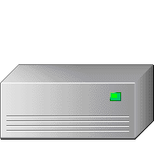
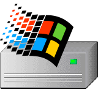

*English translation will be soon...*

*Until the translation is ready, use [Google Translation](https://github-com.translate.goog/nestoris/Win98SE/tree/main/reference?_x_tr_sl=ru&_x_tr_tl=en&_x_tr_hl=ru&_x_tr_pto=wapp) of this page.*

# [ru] Особенности стиля.
Стиль значков Windows 98 (R) имеет свои особенности. Они в чём-то сродни византийскому иконописному стилю.

Прежде всего хочу сказать, что эта тема не претендует на совершенство. Это просто попытка адаптировать наиболее подходящий (на мой взгляд) стиль к нынешней реальности с её огромными разрешениями экранов.

* **Главная задача** значков быть **читаемыми**, **узнаваемыми**, **гармонично вписывающимися** в графический интерфейс окружения, но при этом **не отвлекающими** от рабочего процесса своей чрезмерной замысловатостью и излишней проработанностью.
* Значки рабочего стола до появления пиксельной полупрозрачности -- представляют из себя типичный **pixel-art**.
* **Горизонтальные и вертикальные линии**, как правило (почти всегда), делаются толщиной в **один пиксель**.
* **Диагонали** делаются ступенчато с равным количеством пикселей для каждой ступеньки.
* **Круги** и прочие **плавные кривые** линии удобнее делать в старых графических программах для DOS или Windows(R), либо в современных специальных программах для pixel-art-а.
* **Цветовая палитра** (крайне желательно) должна быть единая для всех значков: **256-цветовая, извлечённая из значков Windows(R) 98**. Палитра значков-98:

  * [Для GIMP](GIMP-98.gpl)
  * [Photoshop (R) Color Table](Photoshop-98.act)
  * [ACO для Photoshop (R)](Photoshop-98.aco)
  * [Microsoft RIFF PAL data](Microsoft-98.pal)
  * [JASC-PAL format](Microangelo-98.pal)

Плавныость градиентов достигается засчёт двух методов смешения:

 диффузного

 по образцу (pattern)

**Примеры линий:**

 Правильные диагонали (x4)

 Круги: (x3)

* Линии очертаний делаются без разрывов, за исключением случаев, когда это необходимо для композиции.

Изометрия. (немного теории)

В византийской и русской иконописи используется обратная перспектива, чтобы сохранить ощущение плоскости и предотвратить иллюзию пространственности. Это помогает сохранить ясность ума, сосредоточить внимание на главных задачах и не рассеивать его на созерцание. Геометрия и пиксельность компьютерноего изображения диктует ортогональность, поэтому используется строгая изометрия.

Композиция близка к правильной (сделана из оригинального значка) за исключением очертаний и градиентов. При автоматическом масштабировании очертания объектов часто получаются кривые (потому что почти все графические программы не способны распознавать направление растровых линий и масштабируют их некорректно), градиенты полноцветные (легко исправляется с переводом изображения в режим indexed-color):

Правильные диагонали:

 Пурпурным проведены верные линии. Все программы для пиксельной графики позволяют их делать.

 Диффузные градиенты на ящике после перевода в 256-цветную палитру, встроенную в значки Win98 (присмотритесь). Старые версии Фотошопа для Windows (R) 98 и 2000 (Я сам проверял, а насчёт новых не знаю.) и GIMP могут хорошо переводить RGB изображения в индексный режим с диффузным смешением и смешением по образцу.

* Прежде, чем масштабировать или создавать свой значок, автор должен **понимать**, **для чего** рисует каждую линию, каждый пиксель и понимать, **для чего они существуют** (для информации, или общей красоты).

Оригиналы значка жёсткого диска (в случае GNU/Linux -- блочного устройства): 

Значки с увеличенным масштабом: 

Некоторые отклонения от оригинальной палитры и обязательного отсутствия полупрозрачности пикселей не возбраняются. Использованный ниже голубой цвет отсутствует в оригинальной палитре, края эмблемы сглажены засчёт полупрозрачности. Изображение смонтировано в Inkscape:

# Именование значков

* В первую очередь нужно создавать значки, имена которых указаны в стандарте [FreeDesktop](https://specifications.freedesktop.org/icon-naming-spec/icon-naming-spec-latest.html).
* Подобные им, но имеющие другие имена для различных окружений (KDE, Budgie, Gnome) нужно создавать в виде симлинков на оригиналы, чтобы не занимать лишнее место на диске и облегчить редактриование уже существующих значков.